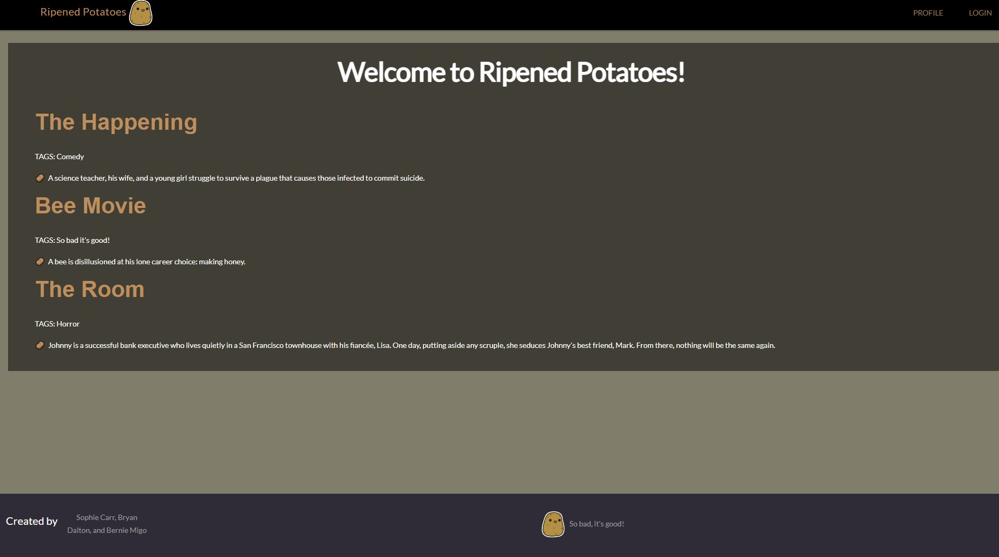

  # Project 2: Ripened Potatoes - A Bad Movie Review Site

  ## Table of Contents
  - [Description](#description)
  - [Technologies Used](#technologies-used)
  - [Usage](#usage)
  - [License](#license)
  - [Contact](#contact)

  ## Description
  There are bad movies, and then there are the movies that are so bad... they're good. The purpose of Ripened Potatoes is to review and discuss such movies. We created this project to demonstrate our backend coding abilities thus far.
  
  ## Technologies Used
  Node.js
  Express.js
  Handlebars.js
  Charts.js
  MySql2
  Sequelize
  Heroku
  
  ## Usage
  The site is free to use, simply follow the deployed link and create an account.
  PLEASE NOTE THIS IS A STUDENT PROJECT AND THE SITE HAS NO SECURITY. WE ARE NOT RESPONSIBLE FOR ANY INFORMATION YOU MAY CHOOSE TO GIVE TO THE SITE.

  Repo: https://github.com/Bryandalton/Ripened_Potatoes
  
 ## Credits

Bryan Dalton, https://github.com/Bryandalton

Bernie Migo, https://github.com/bmigo

## License

MIT license (see Repo)